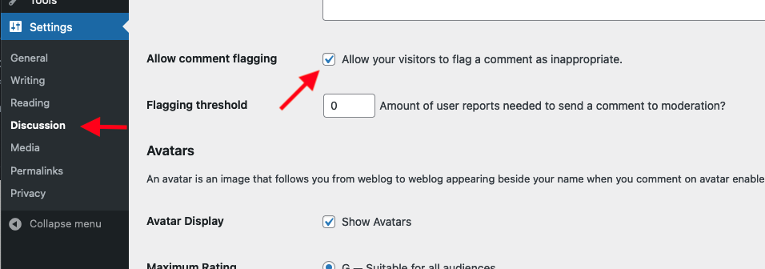
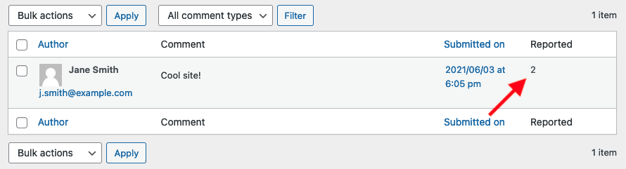
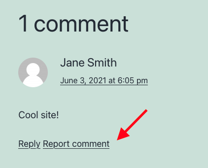
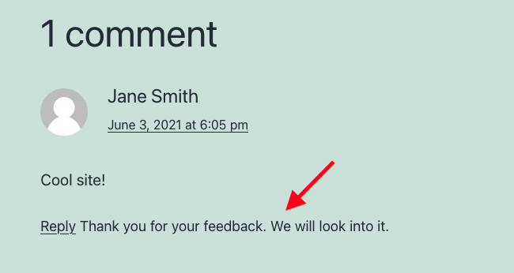

# Safe Report Comments

**Contributors:** tott, danielbachhuber, automattic, garyj  
**Tags:** flagging, comments, report comments, inappropriate, spam  
**Requires at least:** 6.4  
**Tested up to:** 7.0  
**Requires PHP:** 7.4  
**Stable tag:** 0.5.0  
**License:** GPL-2.0-or-later  
**License URI:** https://www.gnu.org/licenses/gpl-2.0.html  

This plugin gives your visitors the possibility to report a comment as inappropriate. After a set threshold is reached the comment is put into moderation where the moderator can decide whether to approve it. If a comment is approved by a moderator it will not be auto-moderated again while still counting the amount of reports.

## Description

This plugin gives your visitors the possibility to report a comment as inappropriate. After a set threshold is reached the comment is put into moderation where the moderator can decide whether to approve it. If a comment is approved by a moderator it will not be auto-moderated again while still counting the amount of reports.

## Installation

1. Download and unzip the plugin.
2. Copy the `safe-report-comments` directory into your plugins folder.
3. Visit your Plugins page and activate the plugin.
4. A new checkbox called "Allow comment flagging" will appear on the **Settings → Discussion** page.
5. Activate the flag and set the threshold value, which appears on the same page once flagging is enabled.

## Screenshots

## Customizations

By default this plugin should work with most existing themes without any changes. It appends the flagging link to each comment and then, in the browser, moves it next to that comment's reply link. The reply link is located via its core `data-commentid` attribute, so placement does not depend on your theme's specific markup.

The report link ships unstyled and inherits your theme's link styles from wherever it appears, so it can look different next to a reply link than at the end of a comment (the deepest threading level, which has no reply link). To adjust or unify its appearance, target the `.safe-comments-report-link` class in your theme's CSS.

If you would rather control the placement yourself, you can place the flagging link manually. Define `no_autostart_safe_report_comments` in your theme's `functions.php` file and initialize the class with auto-attachment disabled: `$safe_report_comments = new Safe_Report_Comments( false );`.

Here is an example of a custom setup in `functions.php` that places the flagging link via a comment callback function.

In `functions.php`:

~~~php
// Flag comments plugin included in theme's functions.php - disable plugin.
define( 'no_autostart_safe_report_comments', true );
include_once( 'replace-with-path-to/safe-report-comments/safe-report-comments.php' );
// Make sure not to auto-attach to the comment reply link.
$safe_report_comments = new Safe_Report_Comments( false );

// Change link layout to have a pipe prepended.
add_filter( 'safe_report_comments_flagging_link', 'adjust_flagging_link' );
function adjust_flagging_link( $link ) {
	return ' | ' . $link;
}

// Adjust the text to "Report abuse" rather than "Report comment".
add_filter( 'safe_report_comments_flagging_link_text', 'adjust_flagging_text' );
function adjust_flagging_text( $text ) {
	return 'Report abuse';
}
~~~

In your custom comment callback function used by [`wp_list_comments`](https://developer.wordpress.org/reference/functions/wp_list_comments/), place the following action, which prints the link:

~~~php
<?php do_action( 'comment_report_abuse_link' ); ?>
~~~

A possible callback function could look like this:

~~~php
function mytheme_comment( $comment, $args, $depth ) {
	$GLOBALS['comment'] = $comment; ?>
	<li <?php comment_class(); ?> id="li-comment-<?php comment_ID() ?>">
		
">
			

				<?php echo get_avatar( $comment, $size = '48', $default = '<path_to_url>' ); ?>
				<?php printf( __( '<cite class="fn">%s</cite> says:' ), get_comment_author_link() ) ?>
			

			<?php if ( $comment->comment_approved == '0' ) : ?>
			<em><?php _e( 'Your comment is awaiting moderation.' ) ?></em>
			 
		<?php endif; ?>
		
<a href="<?php echo htmlspecialchars( get_comment_link( $comment->comment_ID ) ) ?>"><?php printf( __( '%1$s at %2$s' ), get_comment_date(), get_comment_time() ) ?></a><?php edit_comment_link( __( '(Edit)' ), '	 ', '' ) ?>

		<?php comment_text() ?>

		

			<?php comment_reply_link( array_merge( $args, array( 'depth' => $depth, 'max_depth' => $args['max_depth'] ) ) ) ?>
		

		

			<?php do_action( 'comment_report_abuse_link' ); ?>
		

	

	<?php
}
~~~

There are various other actions and filters within the plugin that allow you to alter its behaviour. Please see the inline documentation for details.

## Notes

At the maximum threading depth WordPress does not render a reply link, so in automatic mode the flagging link stays at the end of the comment rather than moving next to a reply link. The link still works as normal. Earlier versions attached to the reply link itself and so showed no flagging link at all at this depth.

## Changelog

The full changelog is maintained in [CHANGELOG.md](https://github.com/Automattic/safe-report-comments/blob/develop/CHANGELOG.md).
