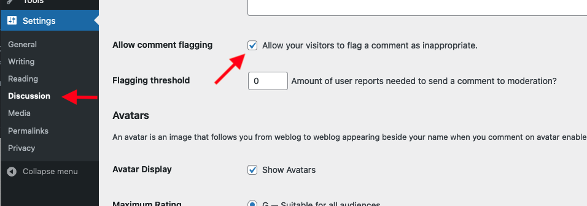
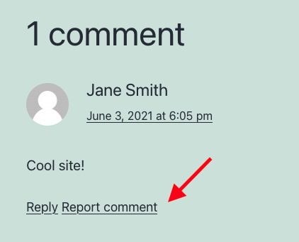
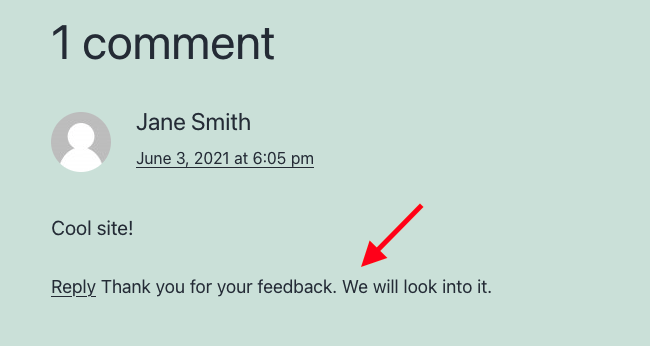

[](https://github.com/Automattic/safe-report-comments/actions/workflows/integrate.yml)

# Safe Report Comments

This plugin gives your visitors the possibility to report a comment as inappropriate. After a set threshold is reached the comment is put into moderation where the moderator can decide whether or not he want to approve the comment or not. If a comment is approved by a moderator it will not be auto-moderated again while still counting the amount of reports.

## Installation

1. Download and unzip the plugin.
2. Copy the safe-report-comments directory into your plugins folder.
3. Visit your Plugins page and activate the plugin.
4. A new checkbox called "Allow comment flagging" will appear in the Settings->Discussion page.
5. Activate the flag and set the threshold value which will appear on the same page after activation

## Screenshots









## Changelog

### 0.4.1 (July 23, 2014)

* Typo fix, props spencermorin

### 0.4 (July 23, 2014)

* Security fix, h/t vortfu

### 0.3.2 (Mar. 6, 2013)
* New 'safe_report_comments_allow_moderated_to_be_reflagged' filter allows comments to be reflagged after being moderated.

### 0.3.1 (Nov. 21, 2012)
* Use home_url() for generating the ajaxurl on mapped domains, but admin_url() where the domain isn't mapped.

### 0.3 (Nov. 7, 2012)
* Coding standards and cleanup

## Customizations

By default this script should hook in just fine in most existing themes as it attaches itsself after the comment-reply link via the comment_reply_link filter.
In case this does not work out you can place the flagging link manually by defining no_autostart_safe_report_comments in your themes' functions.php file and initializing the class via `$safe_report_comments = new Safe_Report_Comments(false);`.

Here is an example of a custom setup via `functions.php` and placing the link comments callback function.

In `functions.php`:

```
//flag comments plugin included in themes' functions.php - disable plugin.
define( 'no_autostart_safe_report_comments', true );
include_once( 'replace-with-path-to/safe-report-comments/safe-report-comments.php');
// make sure not to auto-attach to comment reply link
$safe_report_comments = new Safe_Report_Comments(false);

// change link layout to have a pipe prepended
add_filter( 'safe_report_comments_flagging_link', 'adjust_flagging_link' );
function adjust_flagging_link( $link ) {
	return ' | ' . $link;
}

// adjust the text to "Report abuse" rather than "Report comment"
add_filter( 'safe_report_comments_flagging_link_text', 'adjust_flagging_text' );
function adjust_flagging_text( $text ) {
	return 'Report abuse';
}
```

In your custom comment callback function used by `wp_list_comments`: [http://codex.wordpress.org/Template_Tags/wp_list_comments](http://codex.wordpress.org/Template_Tags/wp_list_comments) place the following action which will print the link.

`<?php do_action( 'comment_report_abuse_link' ); ?>`

A possible callback function could look like this:

```
function mytheme_comment($comment, $args, $depth) {
	$GLOBALS['comment'] = $comment; ?>
	<li <?php comment_class(); ?> id="li-comment-<?php comment_ID() ?>">
		<div id="comment-<?php comment_ID(); ?>">
			<div class="comment-author vcard">
				<?php echo get_avatar($comment,$size='48',$default='<path_to_url>' ); ?>
				<?php printf(__('<cite class="fn">%s</cite> <span class="says">says:</span>'), get_comment_author_link()) ?>
			</div>
			<?php if ($comment->comment_approved == '0') : ?>
			<em><?php _e('Your comment is awaiting moderation.') ?></em>
			<br />
		<?php endif; ?>
		<div class="comment-meta commentmetadata"><a href="<?php echo htmlspecialchars( get_comment_link( $comment->comment_ID ) ) ?>"><?php printf(__('%1$s at %2$s'), get_comment_date(),  get_comment_time()) ?></a><?php edit_comment_link(__('(Edit)'),'	 ','') ?></div>

		<?php comment_text() ?>

		<div class="reply">
			<?php comment_reply_link(array_merge( $args, array('depth' => $depth, 'max_depth' => $args['max_depth']))) ?>
		</div>
		<div class="report-abuse">
			<?php do_action( 'comment_report_abuse_link' ); ?>
		</div>
	</div>
	<?php
}
```

Furthermore there are various actions and filters within the script to allow easy alteration of implemented behavior. Please see inline documentation.

## Known issues

Automatic mode implementation currently does not work with threaded comments in the last level of threading. As the script attaches itself to the comment_reply which is not displayed once the maximum threading level is reached the abuse link is missing at this point. As a workaround set the threading level higher than the likely amount of threading depth.


